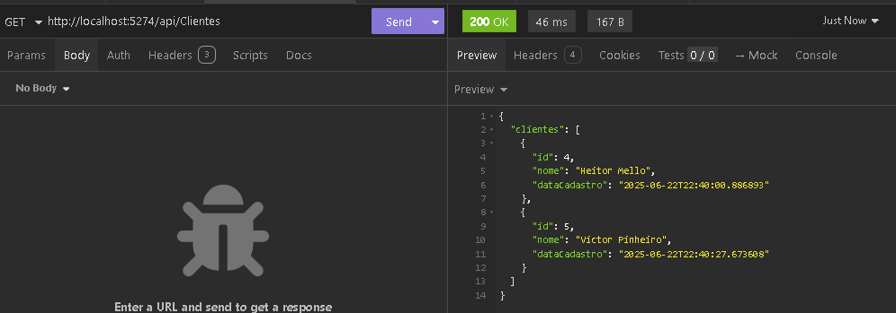
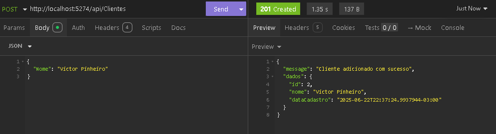
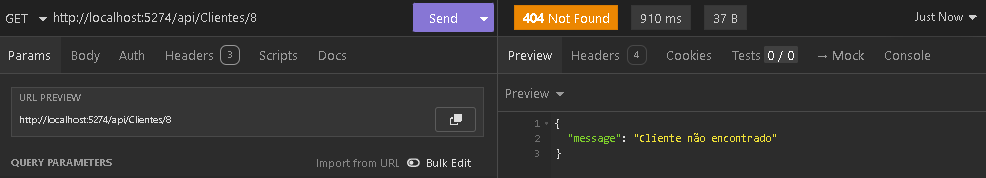
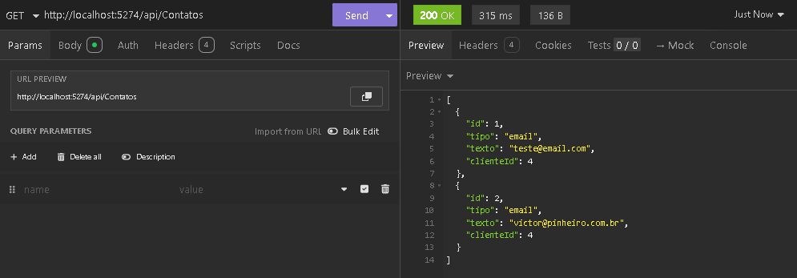
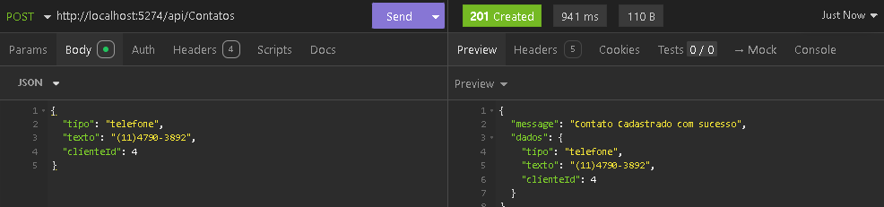
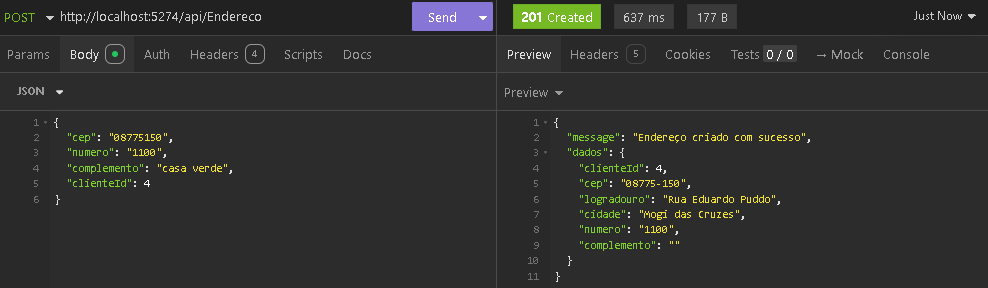
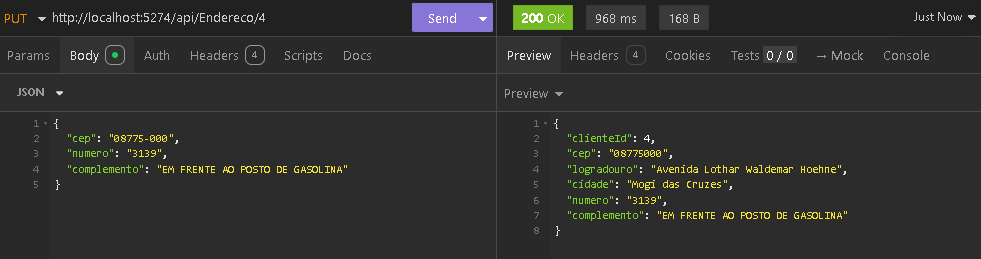

# 📌 README - Desafio Técnico Backend (C# .NET Core)

### Visão Geral
Este projeto foi desenvolvido para um desafio técnico que tem como objetivo avaliar habilidades no desenvolvimento de APIs backend utilizando C# e .NET Core.

O desafio tem como foco, o cadastro, consulta, exclusão, listagem e pesquisa de clientes, ou seja, CRUD completo.

## 🚀 Tecnologias Utilizadas

C# com .NET Core 8.0 

Entity Framework Core para mapeamento e manipulação do banco de dados

AutoMapper para conversão entre entidades e DTOs 

API Externa (ViaCep) para consulta automática de dados de endereço via CEP

Insomnia para testes das rotas


## 📋 Modelagem do Banco de Dados

Entidade          | Campos        | Observações  
-----------------|-------------------|------------------  
Cliente| Id, Nome, DataCadastro| Entidade Principal  
Contato| Id, Tipo, Texto| Relacionamento N:1 com cliente

 ### Detalhes dos campos da entidade Endereço

- Cep  
- Logradouro  
- Cidade  
- Numero  
- Complemento  
- ClienteId  
                
> **Importante:** A entidade Endereço **não possui Id próprio**, estando diretamente vinculada ao Cliente via `ClienteId`.


## ⚙️ Funcionalidades Implementadas

### Cliente
 - Criar novo cliente

 - Consultar cliente por ID (parcial ou detalhado(com endereco e contatos))

 - Listar todos os clientes

 - Atualizar dados do cliente

 - Excluir cliente

 - Pesquisar cliente por nome endereco ou contato (query string)

 ### Contato
 - Criar contato associado a um cliente

 - Consultar contatos por cliente

 - Atualizar contato

 - Excluir contato

 - Pesquisar contato por texto

 ### Endereço
 - Criar/atualizar endereço ao informar CEP (consulta ViaCEP automática)

 - Consultar endereço do clientee

 - Excluir endereço do cliente

## 🔗 Endpoints da API
### 🧍 Clientes

Método | EndPoint| Descrição 
-----------------|-------------------|------------------  
POST| /api/Clientes| Criar novo cliente
GET| /api/Clientes| Listar entidade Cliente
GET| /api/Clientes/Details| Listar clientes com endereco e contato
GET| api/Clientes/{id}| Listar um cliente
GET| api/Clientes/pesquisar?termo=| Pesquisar por nome, endereço ou contato
PUT| api/Clientes/{id}| Editar cliente
DELETE| api/Clientes/{id}| Excluir cliente
 

### ☎️ Contatos

Método | EndPoint| Descrição 
-----------------|-------------------|------------------  
POST| /api/Contatos| Criar novo contato
GET| /api/Contatos| Listar contatos cadastrados
GET| api/Contatos/{id}| Listar um contato parametro
GET| api/Contatos/pesquisar?termo=| Pesquisar contato por texto
PUT| api/Contatos/{id}| Editar contato
DELETE| api/Contatos/{id}| Excluir contato

### 🏠 Endereços

Método | EndPoint| Descrição 
-----------------|-------------------|------------------  
POST| /api/Endereco| Criar novo endereço
GET| /api/Endereco| Listar endereços cadastrados
GET| api/Endereco/{id}| Listar um endereço parametro
GET| api/Endereco/pesquisar?termo=| Pesquisar endereço por cep, cidade, rua, numero
PUT| api/Endereco/{id}| Editar endereço completo por Cep(ViaCEP)
PATCH| api/Endereco/{id}| Editar numero e complemento
DELETE| api/Endereco/{id}| Excluir endereço


## Como Rodar a API Localmente

 Siga este passo a passo completo para executar a aplicação em seu ambiente de desenvolvimento:

### Pré-requisitos
MySQL Workbench instalado 

.NET 8.0 SDK 

Git 

Insomnia (opcional para testes) 

### Configuração Inicial
#### 1 - Clone o repositório:

```bash
  git clone https://github.com/victorpiinheiro/Teste_BackEnd
  cd Teste_BackEnd
```

#### 2 - Exclua a pasta de migrations do projeto (O EF irá fazer o trabalho de recria-las)

#### 3 - Configure o appsettings.json (arquivo na raiz do projeto)

```bash
 {
  "ConnectionStrings": {
    "DefaultConnection": "server=localhost; user=root; password=sua-senha; database=ClientesApi;"
  }
}
```

#### 4 - Crie e aplique as migrations:

```bash
 dotnet ef migrations add Initial
 dotnet ef database update
```

#### 5 - Execute a aplicação:
```bash
 dotnet run
```
Para abrir o Swagger após executar `dotnet run`, veja a URL exibida no terminal, por exemplo:

http://localhost:5274

Basta acessar essa URL no navegador e adicionar `/swagger` no final:

http://localhost:5274/swagger

Assim, você terá acesso à documentação interativa e poderá testar todos os endpoints da API.

### ✅ O que acontece:

O EF Core vai automaticamente:

 - Criar o banco de dados ClientesApi (se não existir)

 - Criar todas as tabelas (Clientes, Contatos, Enderecos)

 - Configurar os relacionamentos


### 🧪 Testes

 - Os testes foram realizados com o Insomnia, cobrindo todos os endpoints da aplicação.

 - As requisições foram organizadas em uma coleção completa com exemplos de payloads e parâmetros.

 - Também foram capturados prints dos testes para visualização rápida da API em funcionamento.

 ## 📸 Exemplos Visuais (Insomnia)

### 🧍 Cliente

#### 🔹 GET /api/Clientes



#### 🔹 POST /api/Clientes



#### 🔸 Erro - ID inexistente



---

### ☎️ Contato

#### 🔹 GET /api/Contatos



#### 🔹 POST /api/Contatos



---

### 🏠 Endereço

#### 🔹 POST /api/Endereco (ViaCEP)



#### 🔹 PUT /api/Endereco/{id}



---

> ⚠️ Para visualizar todas as requisições testadas, consulte a pasta `/docs/prints` ou a pasta `docs/Insomnia_Collection_ClienteApi.json`
